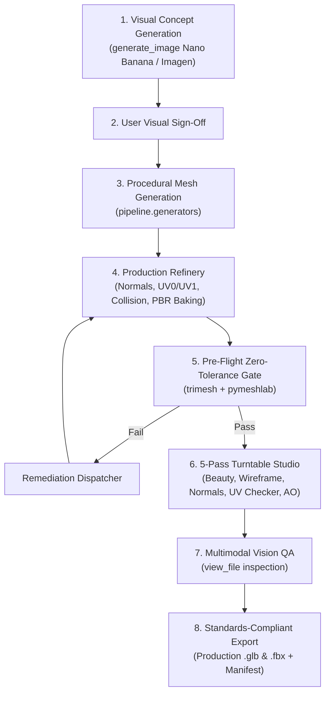

# simWorld 3D Modeling Studio (Local Engine)

Autonomous, production-grade 3D asset creation engine powered by **Blender 4.5 LTS**, **AMD HIP GPU acceleration**, and **Antigravity 2.0**.

---

## 📦 Production Orders & Host Manifest
- **Master Manifest**: [`orders/MANIFEST.md`](orders/MANIFEST.md) — Live tracking of all 3D models, textures, and props required by [`simWorld.Host`](../simWorld.Host).
- **Active Production Orders**:
  - [`orders/ORDER_001_NATURE_ROCKS.md`](orders/ORDER_001_NATURE_ROCKS.md) — Sandstone variants & loose stone chunks (P1 Blocker: 12,989 map instances).
  - [`orders/ORDER_002_FLORA_VEGETATION.md`](orders/ORDER_002_FLORA_VEGETATION.md) — Wild plants, berry bushes, and broadleaf trees (P1 Blocker: 1,380 map instances).
  - [`orders/ORDER_003_ITEMS_AND_PROPS.md`](orders/ORDER_003_ITEMS_AND_PROPS.md) — Wood logs, hunting bows, spears.
  - [`orders/ORDER_004_WOODEN_ARCHITECTURE.md`](orders/ORDER_004_WOODEN_ARCHITECTURE.md) — Timber walls, timber doors, campfire, beds.

---

## 🚀 Capabilities & Standards

The simWorld Studio produces **game-ready 3D assets** ready for immediate drag-and-drop into Unreal Engine 5, Godot 4, Unity, or WebGL engines.

- **DCC Engine**: Blender 4.5 LTS (`C:\Program Files\Blender Foundation\Blender 4.5\blender.exe`).
- **Hardware Acceleration**: AMD Radeon RX 6650 XT (8 GB VRAM) utilizing Cycles AMD HIP compute backend and DirectML ONNX.
- **Dual Execution Modes**:
  - **Headless CLI**: Silent background subprocess execution for automated batch pipelines and CI/CD.
  - **Live MCP**: Real-time viewport streaming via `blender-mcp` on `localhost:9876`.
- **Game Engine Standards Enforced**:
  - Clean quad-dominant topology, zero non-manifold interior edges, zero degenerate triangles.
  - 2-Channel UV architecture: `UV0` (PBR, scaled to standard texel density 5.12 px/cm with 16px padding) and `UV1` (non-overlapping Lightmap in [0, 1]).
  - Industry-standard ORM PBR maps: Red: AO, Green: Roughness, Blue: Metallic.
  - Dual Normal Maps: OpenGL (+Y) for glTF/Godot and DirectX (-Y) for Unreal Engine.
  - Automated collision shapes: `UBX_<Name>_01` (box) and `UCX_<Name>_01` (convex hull <32 vertices), with `-col` suffixes for Godot.
  - Micro-bevel and Weighted Normal shading (`FACE_AREA`, weight=50) for perfect normal gradients without heavy polygon counts.
  - Modular grid alignment: Corner-aligned pivots (Z=0, X=min, Y=0) for architectural modules, ground-aligned (Z=0, X=center, Y=center) for standalone props. Occluded face culling for walls and tiles.

---

## 📋 Mandatory 8-Step Studio Protocol

Every asset created in this workspace adheres to the autonomous creation lifecycle:



---

## 🛠️ CLI Quickstart

### 1. Full Automated Generation & QA Pipeline
Generate, refine, validate, bake textures, render diagnostics, and export in a single command:

```powershell
# Generate a Sci-Fi Modular Bunker Wall (2.0m x 0.2m x 3.0m)
python run_pipeline.py --prompt "Sci-Fi Bunker Wall" --archetype modular_wall --dimensions 2.0 0.2 3.0

# Generate a Reinforced Military Supply Crate (1.0m x 1.0m x 0.8m)
python run_pipeline.py --prompt "Sci-Fi Military Supply Crate" --archetype prop_crate --dimensions 1.0 1.0 0.8
```

### 2. Standalone Pre-Flight Quantitative Gate
Test any existing mesh against zero-tolerance manifold, UV, and boundary rules:

```powershell
python -m pipeline.qa.preflight_validator output/models/SciFiHeavyMilitary.glb
```

### 3. Standalone 5-Pass Turntable Diagnostic Render
Render 5 diagnostic passes (Beauty, Wireframe clay, Normal orientation, UV checkerboard, AO cavity) with the calibrated 85mm studio rig:

```powershell
python -m pipeline.qa.turntable_studio --input output/models/SciFiHeavyMilitary.glb --name SciFiHeavyMilitary
```

---

## 📁 Repository Structure

```
simWorld.Model/
├── .agents/
│   └── rules/
│       └── 3d_studio_workflow.md   # Studio operating rules for Antigravity agents
├── GEMINI.md                       # Workspace context & mandatory protocol
├── run_pipeline.py                 # Master CLI pipeline runner
├── pipeline/
│   ├── blender_locator.py          # Dynamic Blender 4.5 discovery across Windows
│   ├── hardware.py                 # Cycles AMD HIP compute device initializer
│   ├── context_utils.py            # Safe headless BMesh & context override utilities
│   ├── bridge.py                   # Subprocess execution bridge
│   ├── blender_worker.py           # In-Blender orchestration worker
│   ├── generators/                 # Procedural geometry generators
│   │   ├── generator_registry.py
│   │   ├── modular_arch.py         # Walls, floors, pillars with grid snapping
│   │   └── base_props.py           # Watertight crates, containers, canisters
│   ├── refinery/                   # Production finishing modules
│   │   ├── normal_processor.py     # Micro-bevel & Weighted Normal modifiers
│   │   ├── uv_unwrapper.py         # UV0 (PBR 5.12 px/cm) + UV1 (Lightmap)
│   │   ├── collision_generator.py  # UBX_ / UCX_ / -col collision hulls
│   │   └── pbr_baker.py            # Cycles HIP bake + ORM & GL/DX normal maps
│   ├── qa/                         # Automated validation & verification
│   │   ├── preflight_validator.py  # Trimesh + PyMeshLab quantitative gate
│   │   ├── turntable_studio.py     # Calibrated 85mm 5-pass diagnostic studio
│   │   ├── vision_evaluator.py     # Multimodal vision inspection rubric
│   │   └── remediation_dispatcher.py # Automated corrective action dispatch
│   └── exporters/
│       └── production_exporter.py  # Standards-compliant uncompressed GLB & FBX
└── output/
    ├── models/                     # Production .glb, .fbx, and manifests
    │   └── textures/               # ORM, BaseColor, and GL/DX normal maps
    └── renders/                    # 5-pass diagnostic turntable renders
```

---

## 🎮 Game Engine Integration Guide

### Unreal Engine 5
- Drag and drop `.fbx` or `.glb` from `output/models/` into the Content Browser.
- FBX imports automatically detect `UCX_` collision hulls as collision meshes.
- Assign the material with:
  - Base Color -> Base Color
  - `_ORM.png`: Red -> Ambient Occlusion, Green -> Roughness, Blue -> Metallic.
  - `_Normal_DX.png` -> Normal map (UE uses DirectX -Y normal format).

### Godot 4
- Drag and drop `.glb` into the Godot project folder.
- Collision shapes with `-col` suffixes are automatically converted to static bodies with collision shapes.
- Godot natively uses OpenGL (+Y) normal maps (`_Normal_GL.png`).

### Unity
- Import `.fbx` with standard Model importer settings.
- Enable "Generate Colliders" or assign the embedded collision hulls.
- Set Normal Map import setting with standard Unity (+Y) conventions.
